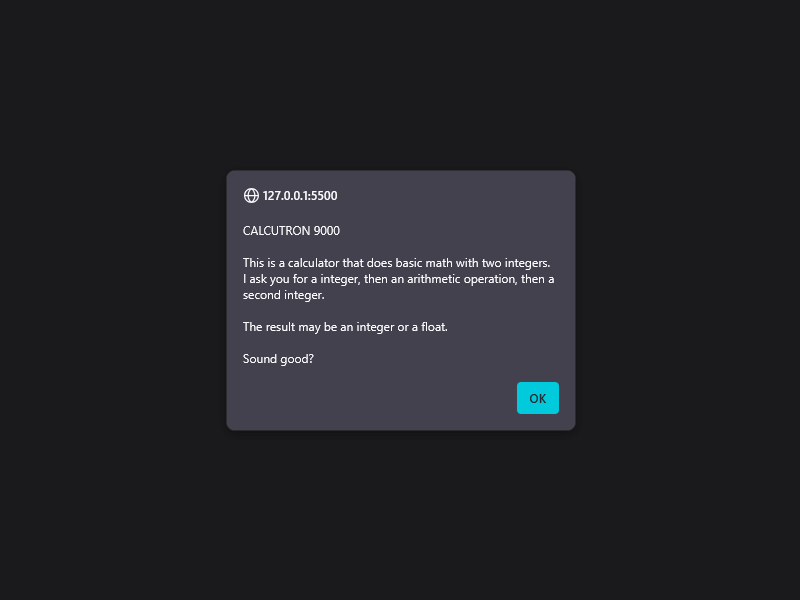

# Activity 4.1.3: Simple Calculator

[Karl Johnson](https://github.com/hirekarl)  
2025-RTT-30  
<date datetime="2025-06-16">2025-06-16</date>  

## Overview
### Viewer Instructions
Go to [luminous-caramel-d3e034.netlify.app](https://luminous-caramel-d3e034.netlify.app/), or view my solution below.

### Solution
- Activity 4.1.3: Simple Calculator (source at [`./scripts/app.js`](./scripts/app.js))

#### Notes
For this activity, I decided to practice breaking up the app's functionality into modules and functions. The design spec allowed use of `alert()` or `console.log()` for program output&mdash;I went with `alert()`.

#### Features
- The program greets the user as CALCUTRON 9000 and explains basic user interface and accepted input values on the first `alert()`.
- The program only accepts integers, and will validate user input until valid integers are given as operands and a valid operand is given of the set {`+`, `-`, `*`, `/`}.
- The program displays both the user's given arithmetic expression and the result of that expression in the final `alert()`.
- The program closes the containing browser window on exit.

#### Possible Improvements
- The program gives `"NaN is not a valid integer. Try again."` when a `String` is given as an operand. A more graceful message could be written to notify the user that the input must be both a `Number` and an integer, instead of giving `NaN`, which has no meaning for users.

### Activity Instructions:
Build a basic calculator that takes two inputs from the user and performs addition, subtraction, multiplication, or division based on user input.

1. Use `prompt()` to get input from the user.
2. Create a function for each mathematical operation.
3. Return and display the result using `console.log()` or in the browser using `alert()`.